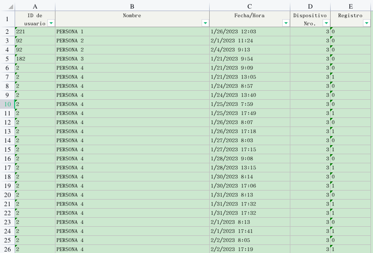
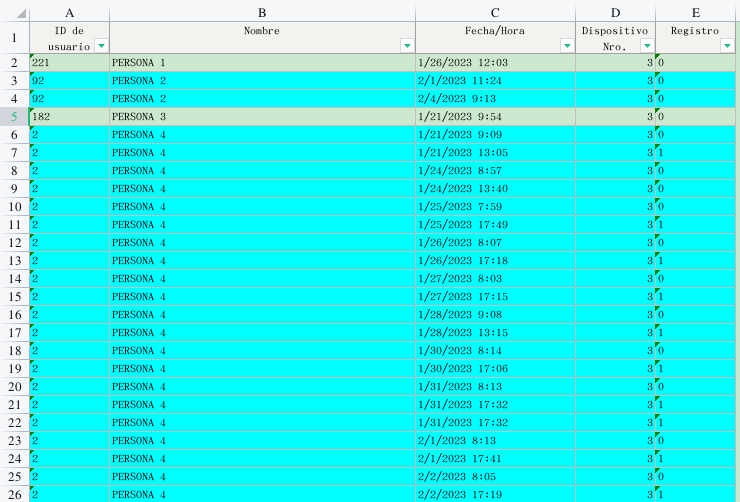

# PYTHON SCRIPT

Script hecho en python para dar color a celdas de un archivo excel tomando como referencia los ID's y en base a el cambio de ID colorear las columnas correspondientes.

## Librerias necesarias

* openpyxl
* os
### ***Imágen antes de pasarle el script.***

### ***Imágen después de pasarle el script.***

El uso es muy sencillo, solo hay que pasarle la ruta dónde se encuentra ubicado el archivo de excel al que deseamos colorear.